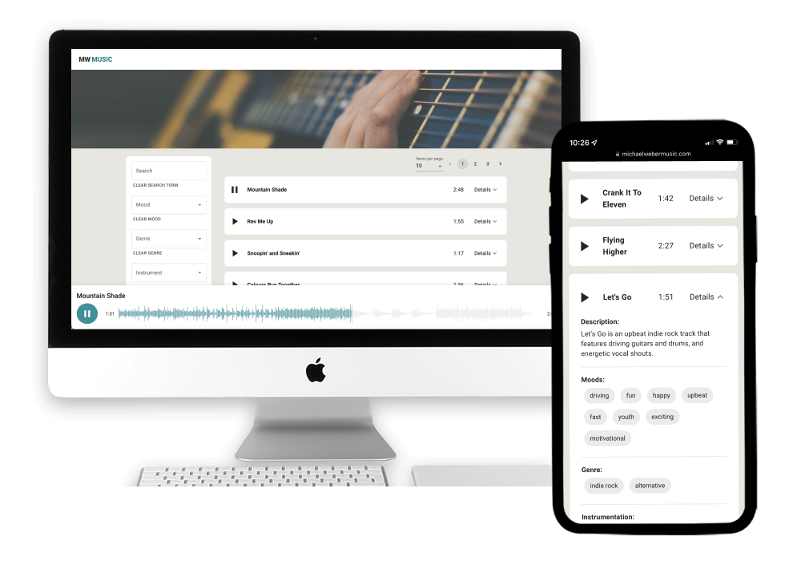

# MusicCueLibrary

A searchable music player web app to showcase my music compositions.

## Table of contents

- [Overview](#overview)
  - [The challenge](#the-challenge)
  - [Screenshot](#screenshot)
  - [Links](#links)
- [My process](#my-process)
  - [Built with](#built-with)
  - [What I learned](#what-i-learned)
  - [Continued development](#continued-development)
  <!-- - [Useful resources](#useful-resources) -->
- [Author](#author)
<!-- - [Acknowledgments](#acknowledgments) -->

## Overview

### The challenge

Users should be able to:

- Browse through the paginated list of songs, and select how many songs are displayed at a time
- Click on a song's "Play" button to bring up a visual waveform of the song along the bottom of the screen and play the audio
- View each song's expandable details section, which shows the song's description, moods, genres, and instrumentation
- Filter the song list by typing in a search bar, and also via drop-down selects for mood, genre and instrumentation. Users can also click on a song's mood, genre, or insturment within it's details section to update the filtered list

### Screenshots

### Links

- Live Site URL: [https://www.michaelwebermusic.com/library](https://www.michaelwebermusic.com/library)

## My process

### Built with

- Mobile-first workflow
- Semantic HTML5 markup
- SASS (SCSS)
- useState and useEfect hooks
- [React](https://reactjs.org/) - JS library
- [Wavesurfer](https://wavesurfer-js.org/) - Audio waveform visualization library
- [Firebase](https://firebase.google.com/) - Realtime database
- [Material UI](https://mui.com/) - UI library
- [React Router](https://reactrouter.com/) - URL routing library

### What I learned

#### Reading from a Firebase Realtime database

The [Firebase docs](https://firebase.google.com/docs/database) were very helpful in learning how to connect my app to the realtime database.

#### Implementing the Wavesurfer.js library with React hooks

The documentation for Wavesurfer.js is a bit outdated, and it does not include any implementation details for using the library with React. I found [this article](https://dev.to/jamland/audio-player-with-wavesurfer-js-react-1g3b) very helpful.

### Continued development

Ways to improve this app include

- Adding an authenticated admin dashboard to upload new songs to the database
- Creating curated playlists, each with their own URL route
- Currently, audio does not play on mobile devices if the device is set to silent. A fix is described [here](https://github.com/katspaugh/wavesurfer.js/issues/1864), needs to be implemented

<!-- ### Useful resources

- [Example resource 1](https://www.example.com) - This helped me for XYZ reason. I really liked this pattern and will use it going forward.
- [Example resource 2](https://www.example.com) - This is an amazing article which helped me finally understand XYZ. I'd recommend it to anyone still learning this concept.

**Note: Delete this note and replace the list above with resources that helped you during the challenge. These could come in handy for anyone viewing your solution or for yourself when you look back on this project in the future.** -->

## Author

- [Michael Weber](https://michaelweber.dev/)
- [LinkedIn](https://www.linkedin.com/in/michaelscottweber/)

<!-- ## Acknowledgments

This is where you can give a hat tip to anyone who helped you out on this project. Perhaps you worked in a team or got some inspiration from someone else's solution. This is the perfect place to give them some credit.

**Note: Delete this note and edit this section's content as necessary. If you completed this challenge by yourself, feel free to delete this section entirely.** -->
